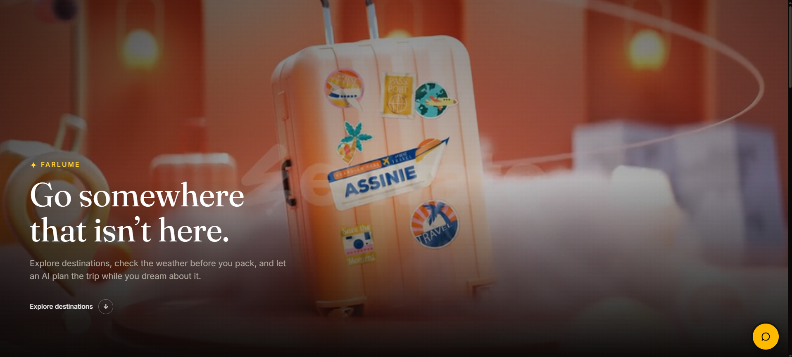
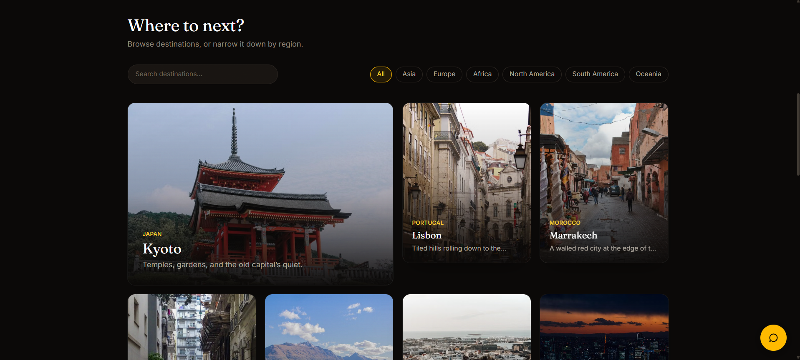
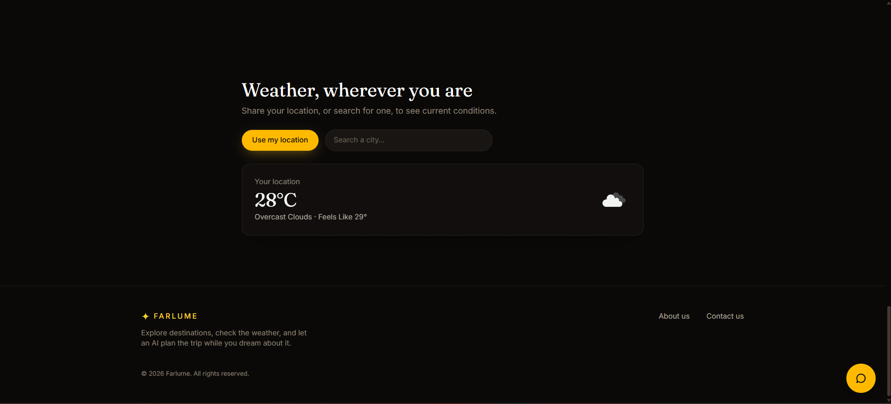
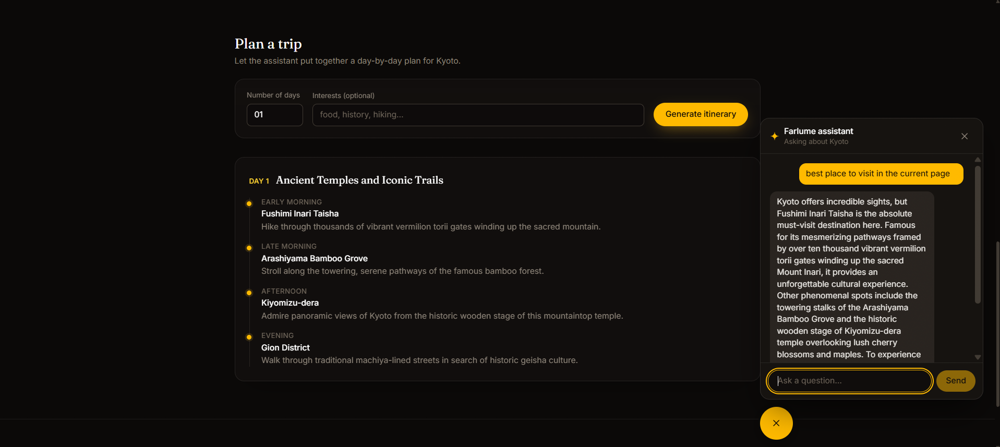

# 🌍 FarLume

## Overview

FarLume is a modern travel web application designed to help users explore destinations, discover famous places, check real-time weather, and plan their trips with AI-powered assistance.

The project was built as part of the **Design Esthetics Front-End Developer Assessment**.

## 🔗 Links

🌐 **Live Application:** far-lume-8i24fbcf5-ibrahimsyed70737.vercel.app

💻 **GitHub Repository:** https://github.com/Ibrahimsyed70737/FarLume

---

## What this app does

- **Browse destinations** — search and filter by region, each one opens its own page
- **Famous places** — every destination shows notable places to visit, with photos
- **Real-time weather** — share your location or search a city, see live conditions
- **Live photography** — every image is fetched from Pexels, not stored in the project
- **AI travel assistant** — a chatbot (floating button, bottom-right) that knows this app's actual destinations and answers travel questions
- **AI itinerary planner** — generates a real day-by-day trip plan, rendered as cards, not chat text
- **About / Contact pages** — with a working contact form (opens your email client)

---

## Tech stack, in plain terms

| Piece | What it's for |
|---|---|
| **React + Vite** | The app itself, and the tool that runs/builds it |
| **React Router** | Switches between pages (Home, a Destination, About, Contact) without reloading the browser |
| **Tailwind CSS** | Styling, using utility classes instead of separate CSS files |
| **Framer Motion** | Animations (fade-ins, page transitions, the loading spinner) |
| **Zustand** | Tiny shared state, used for "what location is currently selected" |
| **OpenWeather API** | Real weather data |
| **Pexels API** | Real destination/place photos, fetched live |
| **Google Gemini API** | The chatbot and the itinerary generator |
| **Vercel** | Where the site is hosted |

---

## How the pieces fit together (the flow)

1. **`src/data/destinations.js`** is the source of truth — a plain list of destinations (name, country, coordinates, description, famous places). No database; it's just JavaScript.
2. **Pages** (`src/pages/`) read from that list and from live APIs:
   - `Home.jsx` → hero + destination grid + weather section
   - `Destination.jsx` → one destination's detail page, weather, famous places, itinerary planner
   - `About.jsx`, `Contact.jsx` → static content + a contact form
3. **Components** (`src/components/`) are the reusable building blocks each page assembles from — cards, weather widgets, the chatbot, the itinerary view, etc.
4. **API calls** live in `src/lib/` (`openweather.js`, `pexels.js`, `gemini.js`) — each one is a small wrapper around a `fetch()` call, so the pages don't talk to the internet directly.
5. **The Gemini (AI) key never reaches the browser.** Instead of the frontend calling Google directly, it calls `/api/chat` — a small serverless function (`api/chat.js`) that holds the real key and forwards the request. This is the one place the app isn't "pure frontend," and it's done this way specifically so the AI key can't be stolen from the page's source code. (OpenWeather and Pexels keys *are* visible in the browser — that's normal and expected for those two, since their keys are low-risk if exposed.)

```
Browser  →  React app  →  /api/chat  →  Google Gemini
                        →  OpenWeather API directly
                        →  Pexels API directly
```

---

## Project structure

```
src/
  components/     reusable UI pieces (cards, weather, chat, itinerary, brand, skeletons)
  pages/          one file per route (Home, Destination, About, Contact)
  data/           the destinations list
  lib/            API wrapper functions (openweather.js, pexels.js, gemini.js)
  hooks/          custom React hooks (geolocation, weather, photo fetching)
  store/          shared app state (Zustand)
api/
  chat.js         serverless function that proxies Gemini requests (keeps the AI key private)
public/
  videos/         hero background video + poster image
```

---

## Running it locally

### 1. Install dependencies

```
npm install
```

### 2. Add your API keys

Copy the example env file:

```
cp .env.example .env
```

Open `.env` and fill in your own keys:

```
VITE_OPENWEATHER_API_KEY=your_openweather_key
VITE_PEXELS_API_KEY=your_pexels_key
GEMINI_API_KEY=your_gemini_key
```

Where to get each one (all free):
- OpenWeather: https://openweathermap.org/api → sign up → API keys tab
- Pexels: https://www.pexels.com/api/ → sign up → get your key instantly
- Gemini: https://aistudio.google.com/apikey → sign in → create key

**Never commit `.env`** — it's already in `.gitignore`, so `git` will ignore it automatically.

### 3. Start the dev server

```
npm run dev
```

Open the URL it prints (usually `http://localhost:5173`).

The AI features work locally too — a small dev-only proxy in `vite.config.js` mirrors the same `/api/chat` behavior that runs in production, so `GEMINI_API_KEY` stays private even in development.

### 4. Build for production (optional, to test the real build)

```
npm run build
npm run preview
```

---

## Deploying (Vercel)

See the step-by-step guide (also covers pushing to GitHub first) — either the PDF/guide provided alongside this project, or the short version:

1. Push this project to a **public** GitHub repo.
2. Go to https://vercel.com → **New Project** → import that repo.
3. Before deploying, add the same three environment variables from your `.env` file, under **Environment Variables** (Vercel will not see your local `.env` file — you must re-enter them there).
4. Click **Deploy**.
5. Once live, open the URL Vercel gives you in a private/incognito window to double-check everything works with no leftover local state.

---

## Notes on how errors are handled

Every external call (weather, images, the AI, geolocation) has three states designed on purpose, not left to chance:
- **Loading** — a shimmer skeleton shaped like the real content, or the animated brand mark
- **Success** — the real content
- **Failure** — a clear, specific message (e.g. "Couldn't load weather right now" or a rate-limit notice), never a blank space or a crash

If geolocation is denied, the app tells you and lets you search for a city instead — it doesn't just fail silently.

---

## Accessibility & responsiveness

Tested with axe-core across five screen widths (320px through 1440px) and every route — keyboard navigation, screen-reader-friendly markup, and visible focus states are all in place.


## 📸 Application Screenshots

### 🏠 Home Page



### 🌍 Destination Explorer



### 🌤️ Weather Feature



### 🤖 AI Travel Assistant


